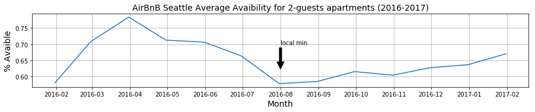
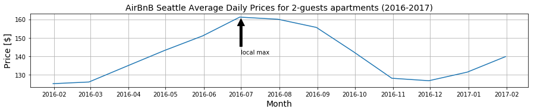

# Data Science Blog Post: The most profitable months on AirBnB Seattle

## Project description

The project uses real-life data provided by AirBnB for Seattle city published on [Kaggle](https://www.kaggle.com/airbnb/seattle/data) to answer the following questions:
1. How can landlord increase his income by increasing his activity on AirBnB?
2. When is the most profitable month to be landlord at AirBnB?
3. When is the most profitable month to be tenant at AirBnB?

I completed this project as part of Udacity Data Science Nanodegree
where my mission was to choose dataset and formulate 3 questions to answer based on the data. To find the solution I had to follow data science CRISP-DM process. For this project it was Business Understanding -> Data Understanding -> Data Preparation -> Evaluation.

The questions I've raised follow my interest in Data-Driven Decisions, Digital Platforms and Sharing Economy.

## Usage
Execute the Jupyter Notebook in the folder 'Code' to reproduce the results. 
The AirBnB Seattle data are part of the repository.

## Libraries used
Python 3
- pandas, matplotlib 

## Files in the repository
- `Code\The most profitable months on AirBnB Seattle.ipynb`: contains Jupyter Notebook file with the source code
- `Dataset\Airbnb_Seattle\listings.csv`: contains overview of AirBnB's listings (`id`, `price`, `host_response_time`)
- `Dataset\Airbnb_Seattle\calendar.csv`: contains overview of AirBnB’s prices in time (`listing_id`, `date`, `price`, `avaibility`)

## Project outcomes
### Answer to Question 1: 
* Question 1: How can landlord increase his income by increasing his activity on AirBnB?

| host_response_time | price | % |
| --- | --- | --- |
| a few days or more | 120.8\$ | 100% |
| within a day | 122.1\$ | 101% |
| within a few hours | 131.3\$ | 109% |
| within an hour | 125.1\$ | 104% |

The table above shows us that landlords responding early command higher prices for renting their houses.
In comparision with landlords taking for response a 'few days or more':
- 4% higher rent commanded by landlords who respond 'within an hour'
- 9% higher rent commanded by landlords who respond 'within a few hours'

Assumption: Since 'price' represents listed data instead of true realized income the statement above is made with the assumption that the [axinom of rationality](https://en.wikipedia.org/wiki/Von_Neumann%E2%80%93Morgenstern_utility_theorem) is valid and landlords set pricing in such a way that their income is maximized.

### Answer to Question 2 & 3:
* Question 2: When is the most profitable to be landlord at AirBnB
* Question 3: When is the most profitable to be tenant at AirBnB
 
Assumption: data in ‘calendar.csv’ contains past data of prices.

The figure above shows us that the most profitable time for landlords (and the most expensive one for tenants) was the July followed by the August. In contrast, during the winter months are average prices the lowest.

In conclusion, we can recommend to AirBnB landlords in Seattle to keep their houses rented during summer months. 
In the contrast, visitors of Seattle can consider postponing their visit to winter months. 

You can read more about AirBnB data in my another project [Stories Hidden in AirBnB Data](https://github.com/JMarcan/stories_hidden_in_airbnb_data)